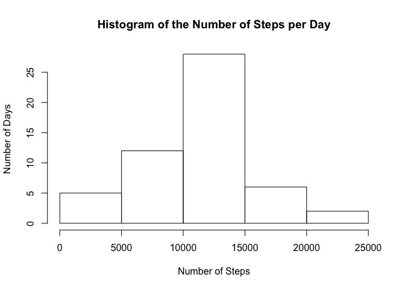
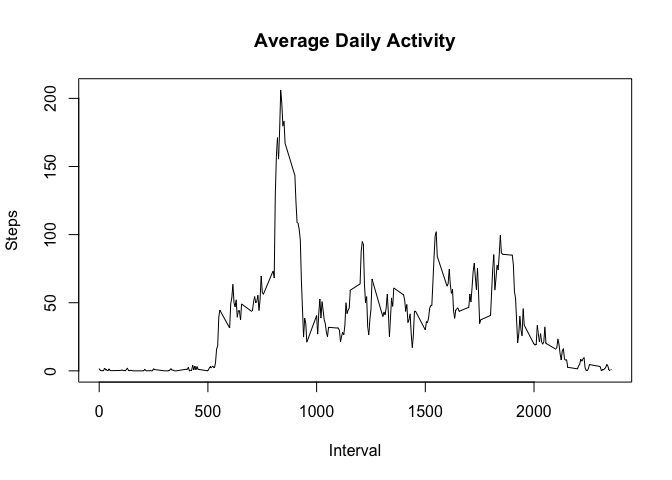
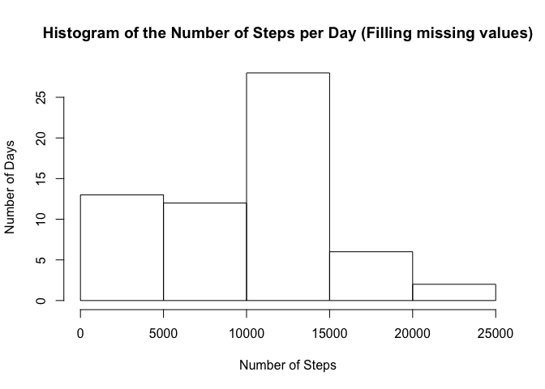

# Reproducible Research: Peer Assessment 1


## Loading and preprocessing the data


```r
library(xtable)

data <- read.csv(file= 'activity.csv')
cleaned <- subset(data, is.na(steps) == 0)
```

## What is mean total number of steps taken per day?


```r
preprocessed <- aggregate(cleaned$steps, by=list(cleaned$date), FUN=sum)
colnames(preprocessed)[1] <- "date"
colnames(preprocessed)[2] <- "steps"

hist(preprocessed$steps, main = "Histogram of the Number of Steps per Day", xlab = "Number of Steps", ylab = "Number of Days")
```

 

### Summary of the total number of steps taken per day

```r
report <- summary(preprocessed$steps)
print(report)
```

```
##    Min. 1st Qu.  Median    Mean 3rd Qu.    Max. 
##      41    8841   10760   10770   13290   21190
```


## What is the average daily activity pattern?


```r
daily <- aggregate(cleaned$steps, by=list(cleaned$interval), FUN=mean)
colnames(daily)[1] <- "interval"
colnames(daily)[2] <- "steps"

plot(x = daily$interval, y = daily$steps, type = "l", xlab = "Interval", ylab = "Steps", main = "Average Daily Activity")
```

 


```r
max <- daily$interval[which(daily$steps==max(daily$steps))]
```

The **835th** 5-minute interval, on average across all the days in the dataset, contains the maximum number of steps. 

## Imputing missing values


```r
missing <- dim(data)[1] - dim(cleaned)[1]
```

The total number of missing values in the dataset is *`2304`*


```r
updated <- data
for(i in 1:dim(data)[1]){
  if (is.na(data$steps[i]) != 0){
    filter <- subset(preprocessed, date == data$date[i])
    
    if (dim(filter)[1] == 0){
      updated$steps[i] <- 0
    } else {
      updated$steps[i] <- filter$steps
    }
  }
}

average <- aggregate(updated$steps, by=list(updated$date), FUN=sum)
colnames(average)[1] <- "date"
colnames(average)[2] <- "steps"

hist(average$steps, main = "Histogram of the Number of Steps per Day (Filling missing values)", xlab = "Number of Steps", ylab = "Number of Days")
```

 

## Are there differences in activity patterns between weekdays and weekends?
